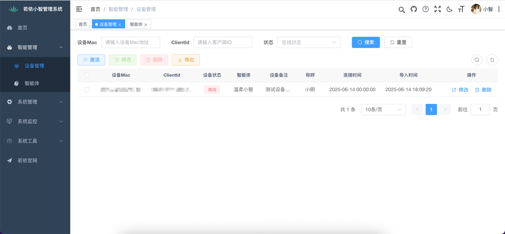

[](https://github.com/dbcjl/RuoYi-xiaozhi)

<h1 align="center">基于若依管理系统的xiaozhi-esp32服务端</h1>

<p align="center">
本项目为开源智能硬件项目
<a href="https://github.com/78/xiaozhi-esp32" target="_blank">xiaozhi-esp32</a>提供Java后端服务<br/>
根据<a href="https://github.com/78/xiaozhi-esp32/blob/main/docs/websocket.md" target="_blank">小智WebSocket通信协议</a>使用RuoYi-Vue、Spring AI、轻量级Java-WebSocket、ffmpeg实现<br/>
帮助您快速搭建小智服务器
</p>

<p align="center">
<a href="https://github.com/dbcjl/RuoYi-xiaozhi/issues" target="_blank">反馈问题</a>
· <a href="./README.md#项目部署" target="_blank">项目部署</a>
· <a href="https://github.com/dbcjl/RuoYi-xiaozhi/releases" target="_blank">更新日志</a>
</p>
<p align="center">
  <a href="https://github.com/dbcjl/RuoYi-xiaozhi/releases">
    
  </a>
  <a href="https://github.com/dbcjl/RuoYi-xiaozhi/graphs/contributors">
    
  </a>
  <a href="https://github.com/dbcjl/RuoYi-xiaozhi/issues">
    
  </a>
  <a href="https://github.com/dbcjl/RuoYi-xiaozhi/pulls">
    
  </a>
  <a href="https://github.com/dbcjl/RuoYi-xiaozhi/blob/main/LICENSE">
    
  </a>
  <a href="https://github.com/dbcjl/RuoYi-xiaozhi">
    
  </a>
</p>

---

## 一、系统要求

- 操作系统：Linux / macOS / Windows
- Java 版本：**azul-Java 21**
- Maven 版本：建议使用 **Apache Maven 3.8+**
- Node.js（仅用于前端模块编译）：**Node.js 18+**

> 备注：本项目基于 **azul-Java 21** 开发，主要为了使用 **虚拟线程（Virtual Threads）** 提升聊天服务的并发处理能力。相比传统线程，虚拟线程更轻量，可显著提高系统吞吐量和响应性能。

## 二、项目技术栈

- **后端框架**：RuoYi-Vue 后端子项目（Spring Boot）
- **通信协议**：<a href="https://github.com/78/xiaozhi-esp32/blob/main/docs/websocket.md" target="_blank">小智 WebSocket 通信协议</a>
- **WebSocket 库**：Java-WebSocket（轻量级嵌入式服务）
- **AI 接口**：Spring AI（OpenAI / 百度 / 阿里等大模型接入）
- **音视频处理**：JavaCV-FFmpeg（音频编码、格式转换等）

> 备注：WebSocket 服务采用 **轻量级 Java-WebSocket 实现**，**不依赖 Tomcat 或 Servlet 容器**，启动更快、运行更轻量。

## 三、功能清单

| 模块名称           | 功能说明                             | 状态       |
|--------------------|----------------------------------|------------|
| 核心服务架构       | 基于 WebSocket 和 HTTP 提供控制台管理与认证系统 | ✅ 已实现   |
| 管理后台           | 提供 Web UI 管理，支持用户、配置和设备管理        | ✅ 已实现   |
| 语音交互系统       | 支持 ASR、流式 TTS、VAD，兼容多语言语音处理      | ✅ 已实现   |
| 智能对话系统       | 集成多种 LLM，实现上下文对话与响应              | ✅ 已实现   |
| 意图识别系统       | LLM + Function Call 实现插件化意图识别与调用 | ✅ 已实现   |
| 记忆系统           | 支持本地短期记忆                         | ✅ 已实现   |
| IOT/MCP控制协议    | 支持设备注册、控制接口，兼容 IOT 与 MCP 协议      | 🔧 开发中   |
| 插件系统           | 支持插件扩展、热加载与自定义插件开发               | 🔧 开发中   |


## 四、语音能力支持列表

### 🎙️ VAD（Voice Activity Detection）声音活动检测

| 名称         | 是否免费 | 是否本地 | 是否支持流式 | 备注说明                                       |
|--------------|----------|----------|----------------|------------------------------------------------|
| Silero VAD   | ✅ 是     | ✅ 是     | ✅ 支持        | 基于神经网络模型，轻量准确，适合边缘端使用      |

> ⚙️ Silero VAD v5 版本已集成并优化，适配低延迟处理场景。

---

### 🗣️ ASR（Automatic Speech Recognition）语音识别

| 名称         | 是否免费 | 是否支持流式 | 备注说明                 |
|--------------|----------|--------|--------------------------|
| SenseVoice   | ✅ 免费  | ❌ 不支持  | 本地化私有部署，适配 ESP32 上传音频 |

> 备注：未来可扩展 Whisper、AliASR、百度 ASR 等大模型方案，支持多语种和更复杂环境下的识别。

---

### 🔊 TTS（Text To Speech）语音合成

| 名称             | 是否免费       | 是否支持流式 | 备注说明                    |
|------------------|------------|----------------|-------------------------|
| EdgeTTS          | ✅ 免费       | ✅ 支持        | 微软 Edge 浏览器接口，支持多语种、多角色 |
| 火山引擎 TTS     | ❌ 收费，有免费额度 | ✅ 双流式支持 | 支持双流，音色丰富、响应快、体验好       |

## 五、项目部署

### 1、下载源码

使用 Git 克隆项目：

```bash
git clone https://github.com/78/xiaozhi-server.git
```

或在 GitHub 页面直接下载 ZIP 包解压也可以。

### 2、启动Redis

本项目基于RuoYi-Vue。该项目依赖 Redis，默认连接本地的 6379 端口，请确保 Redis 已启动。

### 3、创建数据库

- 创建名为 ry-xiaozhi 的 MySQL 数据库；
- 执行初始化 SQL 脚本：sql/ry-xiaozhi-20250615.sql

### 4、配置数据库连接

修改 xiaozhi-admin 模块中的数据库配置文件, 修改成自己的数据库连接信息。
路径：src/main/resources/application-druid.yml

```yaml
# 数据源配置
spring:
    datasource:
        type: com.alibaba.druid.pool.DruidDataSource
        driverClassName: com.mysql.cj.jdbc.Driver
        druid:
            # 主库数据源
            master:
                url: jdbc:mysql://localhost:3306/ry-xiaozhi?useUnicode=true&characterEncoding=utf8&zeroDateTimeBehavior=convertToNull&useSSL=true&serverTimezone=GMT%2B8
                username: root
                password: password
```

### 5、下载并配置 SenseVoice 模型

本项目使用 SenseVoice 模型做本地语音识别，请下载并配置模型路径

```shell
# 下载 SenseVoice 模型
wget https://github.com/k2-fsa/sherpa-onnx/releases/download/asr-models/sherpa-onnx-sense-voice-zh-en-ja-ko-yue-2024-07-17.tar.bz2
# 解压
tar xvf sherpa-onnx-sense-voice-zh-en-ja-ko-yue-2024-07-17.tar.bz2
rm sherpa-onnx-sense-voice-zh-en-ja-ko-yue-2024-07-17.tar.bz2
```

修改 xiaozhi-chat/src/main/resources/application.yml，配置模型路径

```yaml
model:
  asr:
    sense-voice:
      model-dir: /your/local/path/sherpa-onnx-sense-voice-zh-en-ja-ko-yue-2024-07-17
```

### 6、配置 ESP32 OTA 地址

需要<a href="https://icnynnzcwou8.feishu.cn/wiki/JEYDwTTALi5s2zkGlFGcDiRknXf" target="_blank">更改ESP32固件的OTA地址</a>，连接到你自己部署的服务。
OTA 地址示例：http://你的局域网IP:8080/api/ota

ESP32 固件会通过 OTA 接口获取 WS 地址，无需手动配置：
WebSocket 地址将自动拼接为：ws://你的局域网IP:8082/xiaozhi/v1

### 7、配置 LLM 模型（OpenAI 协议兼容）

LLM模型基于Spring AI框架，目前是写死的OpenAI协议的模型，需要配置支持OpenAI协议模型服务商的信息，如下所示。
修改 xiaozhi-chat/src/main/resources/application.yml。

```yaml
chat:
  client:
    apiKey: 你的API密钥
    url: 模型服务地址（如 http://localhost:8000/v1/chat/completions）
    model: 模型名称（如 gpt-3.5-turbo）
```

### 8、启动前端后台管理系统

```shell
cd xiaozhi-ui

# 使用淘宝源加速依赖安装
npm install --registry=https://registry.npmmirror.com

# 启动前端服务（默认 80 端口）
npm run dev
```
> 备注：本项目后端使用 Java 21，必须使用 Azul Zulu 版本（azul-21）。

访问地址：http://localhost
默认账号密码：admin / admin123

### 9、启动服务 & 设备激活

后端服务启动后，未注册的设备将通过语音播报激活验证码。
- 请登录后台管理系统；
- 打开【设备管理】；
- 输入设备播报的验证码，完成激活绑定。
- 刚绑定的设备，未关联相应的智能体，请使用设备的修改功能，管理具体的智能体信息。

✅ 完成以上步骤，即可开始使用小智语音交互与控制服务。

## 六、Windows 环境部署 — 语音组件依赖说明

在 Windows 环境（含 Docker）部署时，语音相关功能依赖以下组件，需提前下载：

### 1. SenseVoice ASR 语音识别模型

| 项目 | 说明 |
|------|------|
| 名称 | sherpa-onnx-sense-voice-zh-en-ja-ko-yue-2024-07-17 |
| 版本 | 2024-07-17 |
| 大小 | ~1GB |
| 用途 | 本地离线语音识别（支持中、英、日、韩、粤语） |
| 下载 | https://github.com/k2-fsa/sherpa-onnx/releases/download/asr-models/sherpa-onnx-sense-voice-zh-en-ja-ko-yue-2024-07-17.tar.bz2 |

下载后解压，在 `xiaozhi-chat/src/main/resources/application.yml` 中配置模型路径：
```yaml
model:
  asr:
    sense-voice:
      model-dir: /你的路径/sherpa-onnx-sense-voice-zh-en-ja-ko-yue-2024-07-17
```

### 2. sherpa-onnx 原生库（JNI）

| 项目 | 说明 |
|------|------|
| 版本 | v1.10.30（需与项目内置的 onnxruntime 1.17.1 匹配） |
| 用途 | SenseVoice 模型推理的 JNI 桥接层 |

项目已内置以下平台的原生库（位于 `sherpa-onnx/src/main/resources/native/`）：
- `linux-x64/` — Linux 64位（Docker 部署用）
- `win-x64/` — Windows 64位
- `osx-aarch64/` — macOS Apple Silicon
- `osx-x64/` — macOS Intel

> 如需更新或补充其他平台，从 https://github.com/k2-fsa/sherpa-onnx/releases 下载对应平台的 JNI 版本，确保 onnxruntime 版本为 **1.17.1**。

### 3. LWJGL + Opus（音频编解码）

| 项目 | 版本 | 用途 |
|------|------|------|
| LWJGL | 3.3.6 | 轻量级 Java 游戏库，提供 Opus 编解码绑定 |
| Opus | 随 LWJGL 3.3.6 | RFC 6716 音频编解码器 |

已通过 Maven 依赖自动管理，支持的平台（`xiaozhi-chat/pom.xml`）：
- `natives-windows` — Windows 64位
- `natives-linux` — Linux 64位
- `natives-macos-arm64` — macOS Apple Silicon
- `natives-macos` — macOS Intel

> 无需手动下载，Maven 构建时自动获取。

### 4. JavaCV + FFmpeg（音频格式转换）

| 项目 | 版本 | 用途 |
|------|------|------|
| JavaCV | 1.5.11 | Java 音视频处理框架 |
| FFmpeg | 7.1 | 音频重采样、格式转换 |

已通过 Maven 依赖管理，支持的平台（`xiaozhi-chat/pom.xml`）：
- `windows-x86_64`
- `linux-x86_64`
- `macosx-arm64`

> 无需手动下载，Maven 构建时自动获取。

### 5. Silero VAD（语音活动检测）

| 项目 | 版本 | 用途 |
|------|------|------|
| Silero VAD | v5 | 基于 ONNX 的语音端点检测 |
| ONNX Runtime | 1.22.0 | 模型推理引擎 |

模型文件已内置于项目中（`xiaozhi-chat/src/main/resources/model/silero_vad.onnx`），无需额外下载。

### 6. TTS 语音合成（二选一）

**EdgeTTS（免费）：**
- 微软 Edge 浏览器 TTS 接口，无需注册
- 需要服务器能访问 `speech.platform.bing.com`

**火山引擎 TTS（推荐）：**
- 需要注册火山引擎账号并开通「大模型语音合成 — 双向流式」服务
- 控制台：https://console.volcengine.com/speech/service/10029
- 获取 AppID 和 Access Token 后配置：
```yaml
model:
  tts:
    volc-tts:
      appid: 你的AppID
      access-token: 你的AccessToken
```

### Docker 部署快速参考

详细的 Docker 部署指南请参考 [docs/docker-deploy-windows11.md](docs/docker-deploy-windows11.md)。

## 鸣谢 🙏

项目的开发离不开社区的支持和帮助，在此我们真诚感谢：

- 感谢 [xiaozhi-esp32-server](https://github.com/xinnan-tech/xiaozhi-esp32-server/tree/main) 项目，为本项目的开发提供了关键参考。

欢迎大家提交 Issue 或 PR，一起让项目变得更好！
